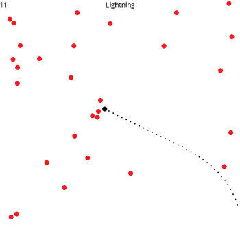

# sdl-arcadeshooter
A lightweight arcade-style game


### Dependencies
```
SDL2
SDL2_image
SDL2_ttf
```
### Build and Run
```
$ g++ source.cpp -w -lSDL2main -lSDL2 -lSDL2_image -lSDL2_ttf -o source
$ ./source
```
